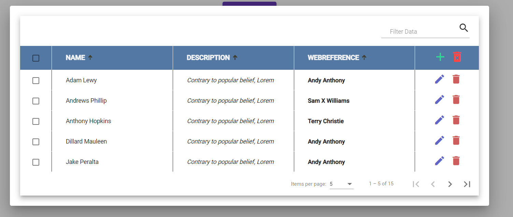

# Paginated Grid Example

## FrameWork Used
Angular version _13.1.2_. for base and AngularMaterial version 13.3.4 is used for material design.

SCSS is used instade of CSS as a CSS preProcessor.

## Assumptions
HttpClient is used to fetch the data of Data.json in future it will be replaced by API to fetch data.

MatIcon is used to avoid external dependencies on other sources.

In Table delete selected button on header is used to delete selected rows.

## To Run
Required **NodeJS _16.13.0_, npm _8.7.0_, angularCLI _13.1.2_**.
>for the first run do a npm install.
>then proceed with below instruction.

## Development server

Run `ng serve` for a dev server. Navigate to `http://localhost:4200/`. The app will automatically reload if you change any of the source files.

<!-- 
## Build

Run `ng build` to build the project. The build artifacts will be stored in the `dist/` directory.

## Running unit tests

Run `ng test` to execute the unit tests via [Karma](https://karma-runner.github.io).

## Running end-to-end tests

Run `ng e2e` to execute the end-to-end tests via a platform of your choice. To use this command, you need to first add a package that implements end-to-end testing capabilities. -->

## SnapShots

